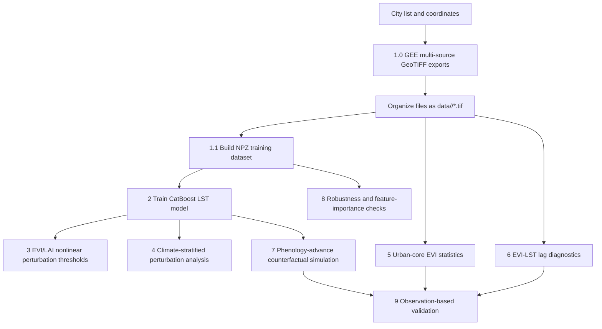

# Global Nonlinear Thresholds and Seasonal Timing of Urban Vegetation Cooling

This repository contains the main code used for the manuscript **"Global nonlinear thresholds and seasonal timing of urban vegetation cooling"**. The workflow combines Google Earth Engine exports, multi-source raster harmonization, CatBoost modelling, model-based perturbation experiments, EVI-LST seasonal lag diagnostics, phenology-shift simulations, robustness checks, and observation-based validation.

The project is a **Google Earth Engine + Google Colab/Python** workflow. It is not a packaged Python library and is not intended to be installed with `pip install`.

The central research questions are:

1. Does urban vegetation cooling show nonlinear thresholds or diminishing marginal returns?
2. How do hot, dry, humid, radiative, and moisture-limited backgrounds regulate the cooling response?
3. Are global urban cores already green enough to reach the greenness levels associated with stronger cooling?
4. Is the timing of vegetation activation aligned with the timing of rapid land-surface warming?
5. Can earlier spring vegetation activation alter warm-season extreme LST, cumulative heat exposure, or seasonal peak timing?

The analysis covers approximately 100 globally distributed cities over 2013-2025. It uses MODIS, VIIRS, ERA5-Land, DEM/SRTM, MODIS land cover, and Koppen-Geiger climate-zone information. A CatBoost model is trained to predict daytime land surface temperature (LST), and interpretable perturbation experiments are then used to quantify the nonlinear response of LST to vegetation greenness and canopy structure, represented mainly by EVI and LAI.

The core data is located in the link; you can download it directly and place it in the specified folder for immediate use. (Includes...ALLCITIES_train_xy_monthly_S10_40pct_ntlmask_TOP100, Köppen_data, selected_cities_fullinfo, typical_timeseries_fast)
## Repository Contents

| File | Environment | Purpose | Typical outputs |
|---|---|---|---|
| `1.0 GEE obtain origin data` | Google Earth Engine Code Editor | Exports city-level raster stacks for land cover, DEM, LST, EVI, LAI, night-time lights, and ERA5-Land | Annual or multi-year GeoTIFF files per city |
| `1.1 Constructing the Dataset` | Colab / Python | Converts city-level multi-band GeoTIFF files into a machine-learning matrix using ERA5-guided sampling and water masking | `ALLCITIES_train_xy_*.npz`, `city_sampling_stats_*.csv` |
| `2. CAT training dataset` | Colab / Python | Trains the CatBoost LST prediction model and saves the model, validation set, and feature names | `catboost_model.cbm`, `channels.npy`, `X_valid.npy`, `y_valid.npy`, `metrics.json` |
| `3. Model-based perturbation analysis` | Colab / Python | Applies positive EVI/LAI perturbations and extracts nonlinear cooling-response metrics | `veg_sensitivity_positive_1pct.json` |
| `4. Analysis of the Influence of Climatic Factors on Vegetation Cooling` | Colab / Python | Repeats EVI/LAI perturbation experiments under different climatic backgrounds | `veg_sensitivity_background_fast.json`, `figs_fast/*.png` |
| `5. EVI Global Statistical Analysis` | Colab / Python | Computes urban-core peak EVI and high-greenness fractions; also includes auxiliary lag-result summary code | `EVI_threshold_core_topP_results.csv`, diagnostic figures |
| `6. Time Lag Calculation and Global Analysis` | Colab / Python | Assigns Koppen-Geiger classes to cities and computes the lag between rapid EVI activation and rapid daytime LST warming | Koppen metadata, lag GeoTIFF files, lag summary CSV files, Fig. 4 outputs |
| `7. Simulation of Vegetation Phenology Effects on LST` | Colab / Python | Builds typical seasonal trajectories and simulates earlier spring vegetation activation with the trained CatBoost model | `typical_timeseries_fast.csv`, Monte Carlo raw/CI CSV files, simulation figures |
| `8.Robustness and validation analyses` | Colab / Python | Performs EVI-LAI correlation checks, drop-group retraining, conditional permutation importance, city-group cross-validation, and CV-SHAP | Multiple JSON/CSV/PNG outputs |
| `9. validating model-implied vegetation cooling responses` | Colab / Python | Validates model-implied cooling responses with observed matched benchmarks and observed timing-shift analogues | Observed matching CSV files, marginal cooling capacity tables, supplementary figures |
| `selected_cities_fullinfo(FullInfo) (1).csv` | Data table | City metadata including city name, country, coordinates, climate zone, population, area, and region | Used for GEE parameters and metadata joins |

## Workflow Overview



The recommended order is to run the scripts by file number. Files `1.0` and `1.1` generate the input data used by almost all later analyses. File `2` trains the core model. Files `3-4` produce the main nonlinear and climate-conditioned perturbation results. Files `5-7` correspond to global greenness, lag diagnostics, and phenology-shift simulation. Files `8-9` are mainly used for robustness and validation analyses.

## Environment

### Google Earth Engine

`1.0 GEE obtain origin data` must be run in the Google Earth Engine Code Editor. The file contains several independent export templates. Each block defines its own city parameters such as:

```javascript
var CITY_NAME      = "Guangzhou";
var CITY_LON       = 113.2644;
var CITY_LAT       = 23.1291;
var CITY_BUFFER_KM = 80;
```

Run one export block at a time, check the city parameters, and then start the export task from the GEE Tasks panel.

### Python / Colab

Most Python scripts were written in Colab notebook style. Some files include notebook magic commands such as `!pip install ...`. If you run the files as standard `.py` scripts, install the dependencies separately or remove those notebook-only lines.

Recommended dependencies:

```bash
pip install numpy pandas rasterio tqdm catboost scikit-learn matplotlib seaborn scipy statsmodels openpyxl pyproj shap
```

If running in Colab, mount Google Drive first:

```python
from google.colab import drive
drive.mount("/content/drive")
```

Most scripts assume the following root directory:

```python
ROOT = "/content/drive/MyDrive/anature_revised/data"
```

If your directory differs, update `ROOT`, `DATA_PATH`, `MODEL_DIR`, `MODEL_PATH`, `OUT_DIR`, and other path variables at the top of each script.

## Suggested Data Directory Structure

GEE outputs should be organized by city:

```text
/content/drive/MyDrive/anature_revised/
  data/
    Guangzhou/
      Guangzhou_EVI_8day_0p1deg_2013.tif
      Guangzhou_LAI_8day_0p1deg_2013.tif
      Guangzhou_LST_8day_0p1deg_2013.tif
      Guangzhou_NTL_monthly_0p1deg_2013.tif
      Guangzhou_ERA5Lmain_8day_0p1deg_2013.tif
      Guangzhou_DEM_8day_0p1deg_2013.tif
      Guangzhou_MODIS_LC_STACK_2013_2025_0p005deg.tif
      ...
    Shanghai/
      ...
  Koppen_data/
    1991_2020/
      *.tif
  selected_cities_fullinfo.xlsx
```

The repository includes `selected_cities_fullinfo(FullInfo) (1).csv`. Some scripts expect `selected_cities_fullinfo.xlsx`; either convert the CSV to XLSX or modify the reading path and function.

## Step 1: Export Input Data from Google Earth Engine

Open `1.0 GEE obtain origin data` in the GEE Code Editor. For each city, set:

```javascript
var CITY_NAME      = "Guangzhou";
var CITY_LON       = 113.2644;
var CITY_LAT       = 23.1291;
var CITY_BUFFER_KM = 80;
```

The script includes export blocks for the following variables:

| Dataset | GEE source | Temporal resolution | Output filename pattern |
|---|---|---|---|
| Land cover | `MODIS/061/MCD12Q1` | Annual, 2013-2025 | `{CITY}_MODIS_LC_STACK_2013_2025_0p005deg.tif` |
| DEM | Static DEM copied into 8-day bands | 8-day | `{CITY}_DEM_8day_0p1deg_{year}.tif` |
| LST | `MODIS/061/MOD11A2`; some code blocks also merge `MYD11A2` | 8-day | `{CITY}_LST_8day_0p1deg_{year}.tif` |
| EVI | Computed from `MODIS/061/MOD09A1` reflectance with `StateQA` filtering | 8-day | `{CITY}_EVI_8day_0p1deg_{year}.tif` |
| LAI | `MODIS/061/MOD15A2H` | 8-day | `{CITY}_LAI_8day_0p1deg_{year}.tif` |
| Night-time lights | `NOAA/VIIRS/DNB/MONTHLY_V1/VCMCFG` | Monthly | `{CITY}_NTL_monthly_0p1deg_{year}.tif` |
| ERA5-Land | `ECMWF/ERA5_LAND/DAILY_AGGR` | Daily fields aggregated to 8-day intervals | `{CITY}_ERA5Lmain_8day_0p1deg_{year}.tif` |

After exporting, place all GeoTIFF files under `ROOT/<city>/`. The downstream Python scripts rely on these filename patterns to infer variables, years, and time steps.

## Step 2: Build the Machine-Learning Dataset

Run `1.1 Constructing the Dataset`. This script scans all city folders under `ROOT`, reads the multi-band GeoTIFF files, and builds a pixel-time training matrix.

Key configuration:

```python
ROOT = "/content/drive/MyDrive/anature_revised/data"
FINE_DEG = 0.005
ERA_DEG = 0.10
SPATIAL_SUBSAMPLE = 1
SAMPLE_FRAC = 1.0
CITY_LIMIT = 100
USE_LATEST_YEAR_ONLY = False
USE_NTL_CORE = False
WATER_CODE = 17
WATER_FRAC_THR = 0.3
TARGET_PREFS = ("LST.LSTD", "LST.LST_DAY", "LST_DAY")
```

Main logic:

1. Scan `.tif/.tiff` files for each city.
2. Parse variable names and temporal labels from band descriptions.
3. Build a unified `T x H x W x C` array for each city.
4. Aggregate dynamic variables using a SUM/COUNT strategy.
5. Use nearest-neighbor resampling for categorical variables and average resampling for continuous variables.
6. Use land-cover-derived water masks to remove water-dominated ERA5-scale blocks.
7. Select one valid pixel per ERA5-scale block to reduce spatial redundancy.
8. Use daytime LST as the target variable `y`.
9. Remove all `LST*` channels from the feature matrix to avoid target leakage.
10. Intersect the available feature channels across cities.
11. Append `META.CITY_ID`.
12. Save the compressed NPZ dataset and city-level sampling diagnostics.

Typical outputs:

```text
/content/ALLCITIES_train_xy_LATEST1Y_fine0.005_S1_100pct_TOP100.npz
/content/city_sampling_stats_LATEST1Y_TOP100.csv
```

NPZ fields:

| Field | Meaning |
|---|---|
| `X` | Feature matrix with shape `n_samples x n_features` |
| `y` | Daytime LST target variable |
| `channels` | Feature names corresponding to columns of `X` |
| `used_cities` | Cities included in the final training matrix |
| `note` | Configuration note saved with the dataset |

## Step 3: Train the CatBoost LST Model

Run `2. CAT training dataset`. First set `DATA_PATH` to the NPZ file produced in Step 2:

```python
DATA_PATH = "/content/ALLCITIES_train_xy_LATEST1Y_fine0.005_S1_100pct_TOP100.npz"
MODEL_OUTDIR = "/content/"
```

The script:

1. Loads `X`, `y`, and `channels`.
2. Drops leakage features whose names start with `LST.`.
3. Drops selected variables such as `ERA5LMAIN.T2M`, `ERA5LMAIN.TD`, `ERA5LMAIN.STL1`, and `META.CITY_ID`.
4. Splits the data into training and validation subsets.
5. Trains CatBoost with GPU if available and falls back to CPU otherwise.
6. Reports RMSE, MAE, R2, and feature importance.
7. Saves the model, validation data, feature names, and metrics.

Typical output directory:

```text
/content/GZ_model_YYYYMMDD_HHMMSS/
  catboost_model.cbm
  channels.npy
  X_valid.npy
  y_valid.npy
  metrics.json
```

Important note: the current script contains repeated training blocks and some inconsistent variable names, such as `X_train/X_val` versus `X_tr/X_va`. Before running it as a clean script, keep one training block and standardize the variable names:

```python
X_tr, X_va, y_tr, y_va = train_test_split(
    X, y, test_size=0.2, random_state=RANDOM_SEED
)
train_pool = Pool(X_tr, y_tr, feature_names=channels)
val_pool = Pool(X_va, y_va, feature_names=channels)
```

When saving the validation set, save the same variables:

```python
np.save(os.path.join(OUT_DIR, "X_valid.npy"), X_va)
np.save(os.path.join(OUT_DIR, "y_valid.npy"), y_va)
```

## Step 4: Estimate Nonlinear EVI/LAI Cooling Responses

Run `3. Model-based perturbation analysis` after setting:

```python
MODEL_DIR = "/content/GZ_model_YYYYMMDD_HHMMSS"
```

The script reads:

```text
catboost_model.cbm
channels.npy
X_valid.npy
y_valid.npy
```

It perturbs one vegetation variable at a time while holding all other predictors fixed:

```text
Delta LST = predicted LST after perturbation - baseline predicted LST
```

Target vegetation features:

```python
veg_features = ["EVI.EVI", "LAI.LAI"]
```

Temperature-background subsets:

| Subset | Definition |
|---|---|
| `All` | All validation samples |
| `High Temp (>=P80)` | Top 20% of `y_valid` |
| `Mid Temp ([P60,P80))` | 60th to 80th percentile of `y_valid` |

Output metrics:

| Metric | Meaning |
|---|---|
| `min_cooling` | Strongest cooling, i.e. the most negative Delta LST |
| `at_delta` | Perturbation magnitude at strongest cooling |
| `sat80_delta` | Perturbation needed to reach 80% of maximum cooling; interpreted as a saturation or threshold indicator |
| `left_slope` | Initial slope near the origin, representing early marginal cooling efficiency |
| `right_slope` | End-of-curve slope, indicating whether marginal effects weaken at high greenness |

Output:

```text
{MODEL_DIR}/veg_sensitivity_positive_1pct.json
```

This step corresponds to the main nonlinear EVI/LAI cooling-response and diminishing-return results in the manuscript.

## Step 5: Analyze Climatic Regulation of Vegetation Cooling

Run `4. Analysis of the Influence of Climatic Factors on Vegetation Cooling` after setting:

```python
MODEL_DIR = "/content/GZ_model_YYYYMMDD_HHMMSS"
MAX_SAMPLES = 30000
```

The script automatically searches for background variables in `channels`:

| Background variable | Matching keywords |
|---|---|
| Temperature-like variable | `LST`, `T2M`, `TEMP` |
| Vapor pressure deficit | `VPD` |
| Shortwave radiation | `SSRD`, `SWDOWN`, `SW` |
| Wind | `WIND10`, `WIND` |
| Precipitation | `TP`, `PRECIP`, `PRCP` |
| Soil moisture | `SWVL1`, `SWVL`, `SM` |

Subset definitions:

```text
HighX >= P80
LowX <= P20
MidTemp = P60-P80
HighTemp >= P80
```

Outputs:

```text
{MODEL_DIR}/veg_sensitivity_background_fast.json
{MODEL_DIR}/figs_fast/EVI.EVI_sensitivity_background_fast.png
{MODEL_DIR}/figs_fast/LAI.LAI_sensitivity_background_fast.png
```

Main metrics:

| Metric | Meaning |
|---|---|
| `CAT` / `cat_delta` | Cooling activation threshold, defined as the first perturbation where Delta LST <= -0.1 C |
| `SCP80` / `sat80_delta` | 80% saturation point |
| `MCE0` / `mce0` | Initial marginal cooling efficiency |
| `min_cooling` | Strongest model-predicted cooling |

This step supports the manuscript result that vegetation cooling is stronger under hot, dry, and high-radiation backgrounds, but weaker under humid or energy-limited conditions.

## Step 6: Global Urban-Core Greenness Statistics

Run the first part of `5. EVI Global Statistical Analysis`.

Key configuration:

```python
ROOT = "/content/drive/MyDrive/anature_revised/data"
CORE_TOP_P = 90
```

For each city, the script:

1. Reads the latest EVI and NTL files.
2. Computes annual or seasonal maximum EVI.
3. Computes annual mean NTL.
4. Defines the urban core as the brightest `CORE_TOP_P` percentile of NTL pixels.
5. Calculates:
   - `core_evi_max_mean`
   - `core_prop_evi_ge05`
   - `core_evi_std`

Output:

```text
/content/EVI_threshold_core_topP_results.csv
```

This analysis evaluates whether global urban cores reach greenness levels associated with stronger vegetation cooling.

The later part of the same script also contains NPZ-based city-level EVI statistics. That block uses `EVI >= 0.4` in some places, while the earlier raster-based section uses `EVI >= 0.5`. Use the threshold that matches the final manuscript version.

## Step 7: Koppen-Geiger Climate Classes and EVI-LST Lag Diagnostics

Run `6. Time Lag Calculation and Global Analysis`. The file has two main sections.

### 7.1 Assign Koppen-Geiger Climate Classes to Cities

Prepare:

```python
CITY_INFO = "/content/drive/MyDrive/anature_revised/selected_cities_fullinfo.xlsx"
KOPPEN_ROOT = "/content/drive/MyDrive/anature_revised/Koppen_data"
KOPPEN_PERIOD = "1991_2020"
```

The script automatically searches for a Koppen-Geiger GeoTIFF under `KOPPEN_ROOT/1991_2020`, samples the raster around each city coordinate, and writes the dominant climate class back to the city metadata table.

Outputs:

```text
selected_cities_fullinfo_with_koppen.xlsx
selected_cities_koppen_check.csv
```

### 7.2 Compute EVI-LST Seasonal Lag

Key configuration:

```python
ROOT = "/content/drive/MyDrive/anature_revised/data"
CITY_INFO = "/content/drive/MyDrive/anature_revised/selected_cities_fullinfo_with_koppen.xlsx"
LAG_OUT_DIR = "/content/drive/MyDrive/anature_revised/Lag4_revised_fullpixels_LSTDonly"
GLOBAL_OUT_DIR = "/content/drive/MyDrive/anature_revised/lag_global_analysis_revised_fullpixels_LSTDonly"

NTL_MIN = 0.01
NTL_KEEP_BRIGHTEST_PCT = 50
SMOOTH_WIN = 5
DIFF_SMOOTH_WIN = 3
ALLOW_PEAK_FALLBACK = False
```

Lag definition:

```text
lag = t_heat - t_LSP
```

Interpretation:

| Lag sign | Meaning |
|---|---|
| `lag > 0` | Vegetation activation precedes rapid daytime surface warming |
| `lag < 0` | Rapid daytime surface warming precedes vegetation activation |

City-year processing steps:

1. Identify all available EVI and LST years for a city.
2. Build a fixed urban-core analysis mask from the latest NTL raster.
3. Resample EVI and daytime LST to the same grid.
4. Align EVI and LST by exact acquisition date if band dates are available; otherwise align by common 8-day sequence length.
5. Interpolate and smooth each valid pixel-level annual time series.
6. Detect the EVI rapid-increase onset `t_LSP` using a derivative-based method.
7. Detect the daytime LST rapid-warming onset `t_heat` using the same derivative-based method.
8. Compute pixel-level lag and aggregate it to city-year and city-level summaries.

Main outputs:

```text
{LAG_OUT_DIR}/{city}_Lag_days_heat_minus_LSP_positive_LSP_leads_*.tif
{LAG_OUT_DIR}/{city}_lag_city_year_summary_*.csv
{GLOBAL_OUT_DIR}/lag_city_year_summary_all_*.csv
{GLOBAL_OUT_DIR}/lag_city_year_balanced_with_metadata_*.csv
{GLOBAL_OUT_DIR}/lag_by_koppen_zone_*.csv
{GLOBAL_OUT_DIR}/lat_vs_lag_mean_*.png
```

The end of the file also includes a clean main-text Fig. 4 plotting block. It outputs:

```text
fig4_revised_maintext_clean/Fig4_clean_maintext.png
fig4_revised_maintext_clean/Fig4_clean_maintext.pdf
fig4_revised_maintext_clean/Fig4_clean_maintext.tif
```

## Step 8: Phenology-Advance Counterfactual Simulation

Run `7. Simulation of Vegetation Phenology Effects on LST`. This file also has two main sections.

### 8.1 Build Typical Seasonal Trajectories

The first section extracts 46-step 8-day seasonal trajectories from city-year raster stacks.

Key configuration:

```python
ROOT = "/content/drive/MyDrive/anature_revised/data"
OUT_TSER = "/content/drive/MyDrive/anature_revised/typical_timeseries_fast.csv"
MAX_CITIES_TOTAL = 100
MAX_CITIES_PER_CLIM = 12
MAX_YEARS_PER_CITY = 1
COARSE_FACTOR = 10
T8 = 46
```

Extracted variables:

```text
EVI, LAI, LST, DEM, ERA5_T2M, ERA5_TD, ERA5_VPD, ERA5_WIND10M,
ERA5_SSRD, ERA5_TP, ERA5_SWVL1, ERA5_STL1, NTL
```

Output:

```text
/content/drive/MyDrive/anature_revised/typical_timeseries_fast.csv
```

Important note: if `koppen_df` is not defined before running this section, cities may be assigned to `UNK`. It is recommended to build `koppen_df` from the output of Step 7:

```python
koppen_df = pd.read_excel("/content/drive/MyDrive/anature_revised/selected_cities_fullinfo_with_koppen.xlsx")
koppen_df = koppen_df.rename(columns={"City": "city_key", "koppen_code": "koppen"})
```

Make sure city names match the folder names under `ROOT`.

### 8.2 Run the Monte Carlo Phenology-Shift Simulation

The second section reads the trained CatBoost model and the typical seasonal trajectory library:

```python
MODEL_PATH = "/content/GZ_model_YYYYMMDD_HHMMSS/catboost_model.cbm"
CHANNELS_NPY = "/content/GZ_model_YYYYMMDD_HHMMSS/channels.npy"
TYPICAL_CSV = "/content/drive/MyDrive/anature_revised/typical_timeseries_fast.csv"
```

Key configuration:

```python
T = 46
DT_DAYS = 8.0
DELTA_DAYS_LIST = list(range(0, 31, 1))
N_MC_PER_GROUP = 300
HEMISPHERE_MODE = "NH"
WARM_DOY = (160, 240)
SHIFT_VARS_MODEL = ["EVI.EVI", "LAI.LAI"]
ROBUST_PEAK_MODE = "topk"
ROBUST_TOPK = 3
```

Simulation design:

1. Read climate-group typical seasonal curves.
2. Generate Monte Carlo baseline time series.
3. Shift only EVI and LAI earlier within the spring green-up window by 0-30 days.
4. Hold all meteorological and urban-background variables fixed.
5. Predict baseline and shifted LST with the trained CatBoost model.
6. Compare three main metrics:
   - `d_warm_p95`: change in warm-season P95 LST.
   - `d_heat_expo`: change in cumulative heat exposure integral.
   - `d_peak_time`: change in robust seasonal peak timing.

The later section includes a random-window placebo control, which applies the same operator to a random seasonal window of equal length. This checks whether the signal is specific to spring phenology advancement.

Main outputs:

```text
typical_timeseries_fast.csv
mc_raw_GLOBAL_NH_greenup_main_plus_placebo.csv
mc_ci_GLOBAL_NH_greenup_main_plus_placebo.csv
Fig_placebo_main_2panels.png
```

This step corresponds to the manuscript analysis of how advancing vegetation activity by around 10 days may affect warm-season P95 LST, cumulative heat load, and peak timing.

## Step 9: Robustness and Feature-Importance Checks

Run `8.Robustness and validation analyses`. This file contains several independent analysis blocks and can be run section by section.

### 9.1 EVI-LAI Correlation, Drop-Group Retraining, and Conditional Permutation Importance

Input:

```python
NPZ_PATH = "/content/drive/MyDrive/anature_revised/ALLCITIES_train_xy_monthly_ERA5guidedREVISED_META_fine0.005_S2_100pct_TOP100.npz"
OUT_DIR = "/content/exp_pack4_steps1_3_meta"
```

The three analyses are:

1. **Correlation structure**: computes global EVI-LAI correlation and within-city correlation distributions.
2. **Drop-group retraining**: trains a baseline model and a second model without EVI and LAI, then compares model performance.
3. **Naive vs conditional permutation importance**: compares standard permutation importance with residual-based conditional permutation importance to reduce bias from EVI-LAI collinearity.

Outputs:

```text
step1_corr_structure.json
step1_evi_lai_hexbin.png
step1_citywise_corr_hist.png
step2_drop_group_summary.json
step3_perm_importance_EVI_LAI.json
step3_perm_importance_naive_vs_cond.png
```

### 9.2 City-Grouped Cross-Validation and Input-Perturbation Robustness

This block uses `GroupKFold` by city so that pixels from the same city do not appear in both training and test folds.

Core idea:

```text
split by city -> train CatBoost -> add Gaussian noise to EVI/LAI -> compare RMSE increases
```

Outputs:

```text
/content/exp_pack_perturb_citycv/perturb_citycv_*.csv
/content/exp_pack_perturb_citycv/perturb_citycv_*.json
```

### 9.3 CV-SHAP Stability

This block also uses city-grouped K-fold cross-validation. It trains a CatBoost model for each fold and computes CatBoost SHAP values on each fold's test subset.

Outputs:

```text
/content/cv_shap_results/cv_shap_city_*/
  cv_metrics.csv
  cv_shap_summary.csv
  cv_shap_summary.json
  cv_shap_top15_stability.png
```

These analyses support claims about spatial generalization, stable feature contributions, EVI-LAI collinearity, and perturbation robustness.

## Step 10: Observation-Based Validation

Run `9. validating model-implied vegetation cooling responses`. This file contains two main validation analyses.

### 10.1 Marginal Cooling Capacity from Observed Matched Curves

Input:

```python
IN_DIR = "/content/drive/MyDrive/anature_revised/section6_7_fast_matched_observed_benchmark"
RESPONSE_FP = os.path.join(IN_DIR, "fast_matched_observed_response_curves.csv")
DIAG_FP = os.path.join(IN_DIR, "fast_matched_observed_coverage_diagnostics.csv")
FEATURE = "EVI.EVI"
```

This block converts observed matched cumulative cooling-benefit curves into marginal cooling capacity:

```text
CB(EVI_k) = LST_low_ref - LST_target_bin
MCC(EVI_k) = [CB(EVI_k) - CB(EVI_{k-1})] / [EVI_k - EVI_{k-1}]
```

Outputs:

```text
observed_EVI_marginal_cooling_capacity.csv
observed_EVI_marginal_cooling_capacity_summary.csv
FigS_observed_EVI_marginal_cooling_capacity.png
FigS_observed_EVI_cumulative_vs_marginal.png
observed_EVI_marginal_cooling_capacity_report.txt
```

### 10.2 Observed Matching Analogue of ML Phenology-Shift Metrics

Input:

```python
DATA_PATH = "/content/drive/MyDrive/anature_revised/multiyear_catboost_npz_with_metadata_fast/ALLCITIES_train_xy_MULTIYEAR_2013_2025_fine0.005_S1_maxCM3000_TOP100_WITH_ROWCOL_LOCALFAST.npz"
OUT_DIR = "/content/drive/MyDrive/anature_revised/section6_10_observed_matching_ML_metrics"
TIMING_FEATURE = "EVI.EVI"
```

This block identifies matched pixel-year pairs within the same city-year where one trajectory has earlier EVI onset and the other has later EVI onset. It controls for static background, climate trajectory, EVI amount, and pre-season LST state.

Main metrics:

| Metric | Definition | Interpretation |
|---|---|---|
| `observed_d_warm_p95` | early P95 - late P95 | Negative values indicate cooler warm-season high-temperature tails for earlier EVI |
| `observed_d_heat_load` | early heat load - late heat load | Negative values indicate lower cumulative heat load |
| `observed_d_peak_time` | early peak DOY - late peak DOY | Positive values indicate delayed LST peak timing |

Outputs:

```text
pixel_year_trajectory_table.csv
observed_matching_ML_metric_cityyear_summaries.csv
selected_cityyear_monthly_LST_trajectory_cooling.csv
FigS_selected_observed_matching_ML_metrics.png
observed_matching_ML_metrics_report.txt
```

Important note: `fast_matched_observed_response_curves.csv` and the multiyear metadata NPZ are intermediate products that are not fully generated by the scripts currently shown in this repository. If these files are missing, the observed matching benchmark must be generated or supplied first.

## Mapping Between Manuscript Sections and Scripts

| Manuscript result section | Main scripts | Description |
|---|---|---|
| 2.1 Magnitude and directionality of LST responses to vegetation change | `2`, `3`, `8` | CatBoost training, feature importance, EVI/LAI perturbation curves |
| 2.2 Climatic regulation of vegetation cooling efficiency | `4` | Perturbation curves stratified by VPD, SSRD, TP, SM, wind, and temperature |
| 2.3 How close cities are to cooling-relevant greenness levels | `5` | Urban-core EVI maximum and high-greenness pixel fraction |
| 2.4 EVI-LST seasonal timing alignment | `6` | `lag = t_heat - t_LSP` across cities, climates, and latitudes |
| 2.5 Phenological advancement and heat-season dynamics | `7` | CatBoost + Monte Carlo counterfactual simulation of spring EVI/LAI advancement |
| Robustness and supplementary validation | `8`, `9` | City-group CV, CV-SHAP, conditional permutation, observed matching validation |

## Important Notes

1. **Check all paths first.** Most scripts use hard-coded Colab paths and must be edited before running.
2. **Run the GEE file by block.** `1.0` is a collection of export templates, not one continuous script.
3. **Keep filename patterns stable.** Downstream scripts infer variables and years from filenames such as `{city}_{var}_..._{year}.tif`.
4. **Prevent LST leakage.** Remove all `LST.*` predictors from the feature matrix and use daytime LST only as the target.
5. **Use `META.CITY_ID` carefully.** It can be used as a city offset in some model runs, but should be removed in grouped CV/SHAP analyses to avoid leakage.
6. **Notebook-style files may require cleanup.** Some scripts contain `!pip`, explanatory text, repeated code blocks, or smart quotes. Run them as Colab cells or clean them before using them as `.py` files.
7. **Pass model directories manually.** Scripts `3`, `4`, and `7` depend on the `MODEL_DIR`, `MODEL_PATH`, and `channels.npy` produced by script `2`.
8. **Generate Koppen metadata before climate-group analyses.** Lag diagnostics and phenology simulations both depend on city climate-zone information.
9. **Large rasters can cause memory pressure.** If memory is insufficient, increase `SPATIAL_SUBSAMPLE` or `COARSE_FACTOR`, reduce `MAX_SAMPLES`, lower `CITY_LIMIT`, or process cities in batches.
10. **Observation-based validation requires additional intermediate files.** Script `9` expects matched benchmark CSV files and a multiyear metadata NPZ.

## Common Errors

| Error | Likely cause | Fix |
|---|---|---|
| `Model not found` | `MODEL_DIR` or `MODEL_PATH` does not point to the real model directory | Use the `GZ_model_*` directory produced by Step 3 |
| `EVI.EVI / LAI.LAI not found` | Channel names differ or band descriptions were not parsed correctly | Print `channels` and check the actual EVI/LAI names |
| `META.CITY_ID not found` | The NPZ was not produced by `1.1` or city ID was not appended | Re-run `1.1` and confirm `channels_final` contains `META.CITY_ID` |
| `koppen_df is not defined` | City climate metadata was not loaded before running script `7` | Build `koppen_df` from `selected_cities_fullinfo_with_koppen.xlsx` |
| Rasterio memory error | Raster stacks are too large or too many cities are processed at once | Increase `SPATIAL_SUBSAMPLE`/`COARSE_FACTOR` or process fewer cities |
| CatBoost GPU failure | GPU is unavailable or CatBoost GPU support is not active | Use the CPU fallback or enable GPU in Colab |
| Python `SyntaxError` | Notebook magic, explanatory text, smart quotes, or repeated blocks were not cleaned | Run in Colab cells or convert the file to standard Python first |

## Minimal Reproduction Path

To reproduce only the core model and perturbation analyses:

1. Use GEE to export EVI, LAI, LST, NTL, ERA5-Land, LC, and DEM for a small subset of cities.
2. Organize the files under `ROOT/<city>/`.
3. Run `1.1 Constructing the Dataset` to generate the NPZ.
4. Run `2. CAT training dataset` to train CatBoost.
5. Run `3. Model-based perturbation analysis` to obtain nonlinear EVI/LAI response curves.
6. Run `4. Analysis of the Influence of Climatic Factors on Vegetation Cooling` to obtain climate-stratified response curves.

To reproduce the full manuscript workflow, continue with scripts `5-9`.

## Data Sources

The workflow uses the following public datasets:

| Dataset | Use |
|---|---|
| MODIS MOD09A1 | EVI calculation from 8-day surface reflectance |
| MODIS MOD15A2H | 8-day LAI |
| MODIS MOD11A2 / MYD11A2 | 8-day daytime and nighttime LST |
| MODIS MCD12Q1 | Annual land cover |
| VIIRS DNB monthly VCMCFG | Night-time lights and urban-core masks |
| ERA5-Land daily aggregates | T2M, TD, VPD, WIND10M, SSRD, TP, SWVL1, STL1, and other meteorological variables |
| DEM/SRTM | Topographic background variables |
| Koppen-Geiger 1991-2020 raster | City climate-zone assignment |

## Interpretation Notes

The model-based perturbation experiments are conditional response analyses. They hold all other variables fixed and alter only EVI or LAI. The resulting curves identify nonlinear response shapes, threshold-like behavior, and climate-conditioned sensitivity learned by the model. They should not be interpreted as direct randomized-experiment causal estimates.

For that reason, the workflow includes additional checks: city-grouped cross-validation, conditional permutation importance, CV-SHAP stability, input-noise perturbation, and observation-based matching validation. These analyses help evaluate whether the model responses are stable and whether they are affected by collinearity, spatial leakage, or unrealistic perturbations.

In the manuscript context, the main finding is that urban vegetation cooling shows nonlinear and diminishing marginal behavior; cooling responses are stronger under hot, dry, and high-radiation backgrounds; many urban cores remain below greenness levels associated with stronger cooling; rapid daytime warming often precedes rapid vegetation activation; and earlier spring vegetation activity may produce small but detectable changes in warm-season LST extremes, cumulative heat load, and peak timing.
